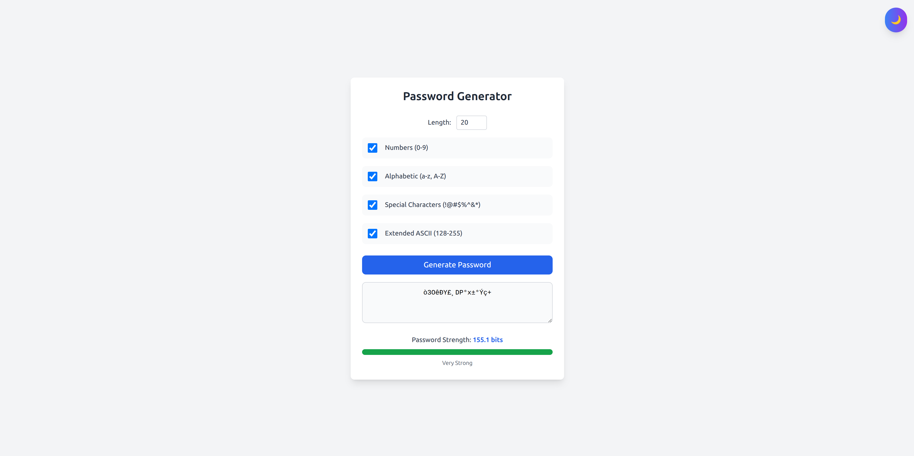
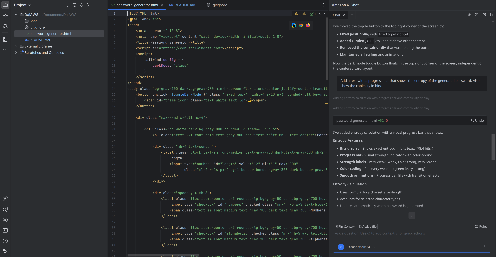

# 🔐 Password Generator

A modern, responsive web-based password generator with entropy calculation and dark mode support.

## ✨ Features

- **Customizable Length**: Generate passwords from 1 to 100 characters
- **Character Types**: 
  - Numbers (0-9)
  - Alphabetic (a-z, A-Z)
  - Special Characters (!@#$%^&*)
  - Extended ASCII (128-255)
- **Password Strength Analysis**: Real-time entropy calculation in bits
- **Visual Strength Indicator**: Color-coded progress bar
- **Dark Mode**: Toggle between light and dark themes
- **Responsive Design**: Works on desktop and mobile devices

## 🎬 Demo

*Screenshot showing the password generator interface with dark mode toggle, character type selection, and entropy visualization.*

## 📖 Usage

1. Open `password-generator.html` in any modern web browser
2. Select desired password length
3. Choose character types using checkboxes
4. Click "Generate Password"
5. View password strength and entropy in bits

## 🛡️ Password Strength Levels

- **Very Weak**: < 30 bits
- **Weak**: 30-49 bits
- **Fair**: 50-69 bits
- **Strong**: 70-89 bits
- **Very Strong**: ≥ 90 bits

## 🛠️ Technologies Used

- HTML5
- CSS3 (Tailwind CSS)
- Vanilla JavaScript
- **Built with Amazon Q Developer** - AI-powered coding assistant

## 📦 Installation

No installation required. Simply download and open `password-generator.html` in your web browser.

## 🤖 Development

This project was developed with the assistance of **Amazon Q Developer**, an AI-powered coding assistant that helped streamline the development process and ensure best practices.

## 📄 License

MIT License